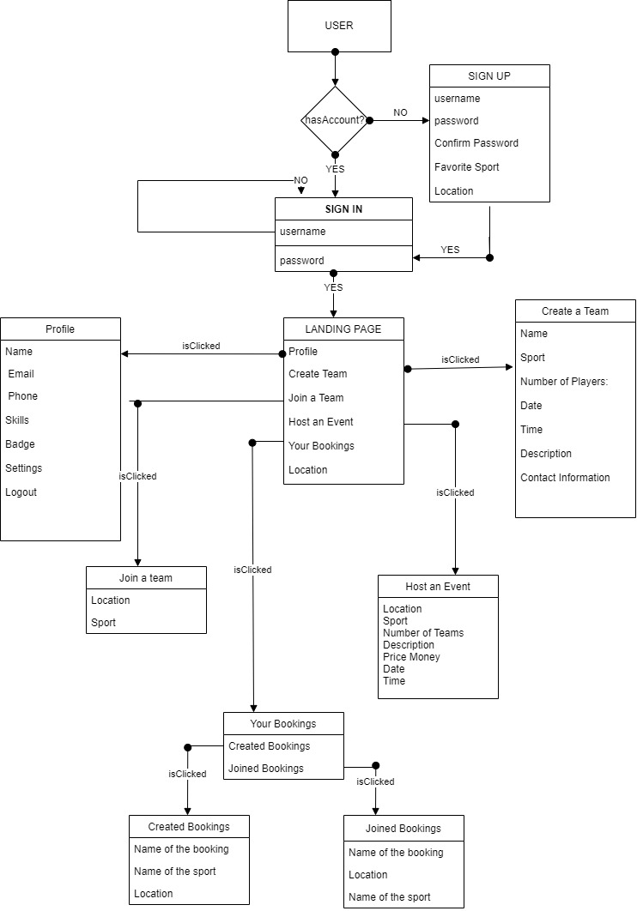

# Playpals
Playpals  connects you to whatever it takes to get your game on, be it to meet playpals, discover venues, manage playgroups or register for events nearby.


### Domain Driven Design





### Flow of the application:


`Playpals is the leading One-Stop Sports App to help bring back sports in everyday lives. We empower local communities to make new pals, organize playgroups, share information/experiences and discover sporting venues/activities.`


## Instructions to Run the web application
- Clone the repo
- Add a file called `keys_dev.js` on your config folder
- Add the follow code to keys_dev.js:
```
module.exports = {
    mongoURI: {Add a connection string from MongoDB Alta},
    secretOrKey: {Enter a random string}
};
```
- Run `npm i && npm start` to start your server
- CD to client folder and run `npm i && npm start` to start the web app


## Roles
* Organizer
* Player


## Flow/User Requirements


* Any new user will be given the option to create a new account.
* They can either create a new event or join an event.
* If the user a creating a new event, he can fill the following details like Name of the event, sport, number of players, date, time, description and  contact information.
* If the user is joining an existing event, they gets an option to choose the sports he want to join and number of positions available for the event.
* The user also has the option to host any tournament and book a ground for the same.
* After the match is completed the host of the event has an option to assign a man of match of that particular event, they host can also rate the skill of the players in his team.
* The user can also see the events booked by them or events joined by the them in the user profile.


## Features:
Login and Register Functionality<br>
Email notification to users<br>
CRUD operations<br>
Search functionality on sports<br>
Authentication<br>
Visualization<br>
View all the events<br>
View the event schedule using calendar.<br>
User friendly and easy application.<br>


## API's Implemented:
JWT tokens for authentication and authorization.<br>
Hash passwords<br>
Mongoose,MongoDB database<br>
EmailJS is for email<br>
ChartJS is for charts.<br>
Axios for API calls.<br>
Full Calendar IO API<br>
Twilio for Login with OTP.<br>


## The technologies used to create this project:
- React.js<br>
- Node.js<br>
- Express.js<br>
- MongoDB<br>
- Mongoose<br>
- Material-UI<br>
- REST API<br>
- Redux<br>


## Team
Shobhit Srivastava(srivastava.sho@northeastern.edu)[002965382] <br>
Shreya Baliga(baliga.s@northeastern.edu)[002795178] <br>
Anuja Patil(patil.anuj@northeastern.edu)[002797645] <br>
Rishab Rajesh Agarwal(agarwal.risha@northeastern.edu)[002766211]


